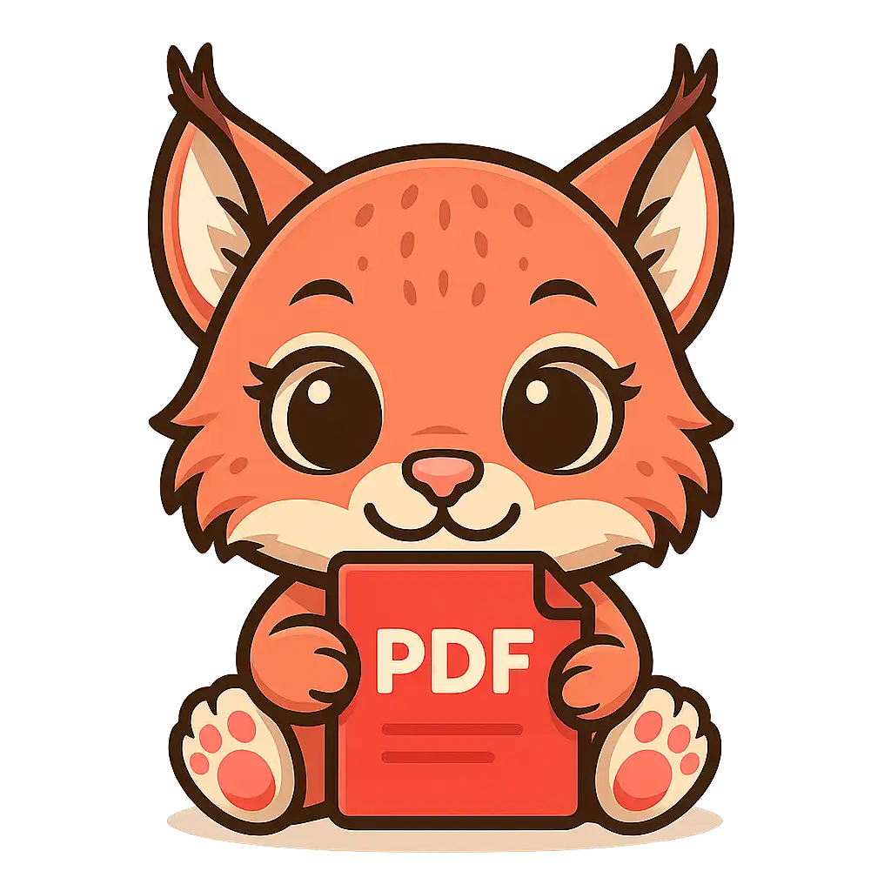
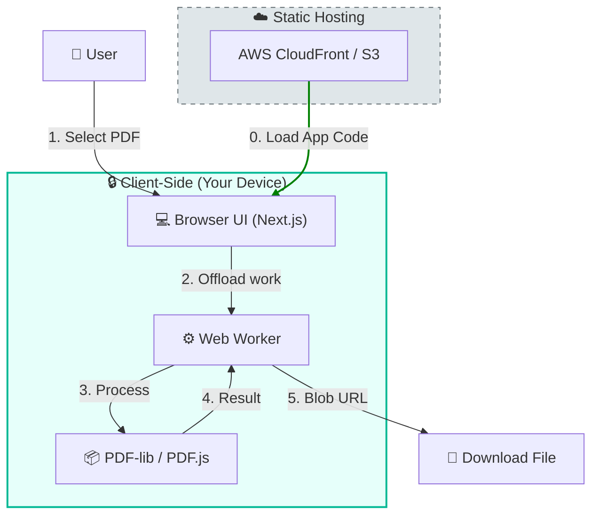

# PDFLince



**The Privacy-First Client-Side PDF Toolkit.**

[](https://pdflince.com/en?utm_source=github&utm_medium=readme&utm_campaign=pdflince_public)
[](https://opensource.org/licenses/MIT)
[](https://github.com/GSiesto/pdflince/actions)

| 🇬🇧 English | 🇪🇸 Español | 🇩🇪 Deutsch | 🇵🇹 Português |
|:---:|:---:|:---:|:---:|
| [pdflince.com](https://pdflince.com/en?utm_source=github&utm_medium=readme&utm_campaign=pdflince_public) | [pdflince.com](https://pdflince.com/es?utm_source=github&utm_medium=readme&utm_campaign=pdflince_public) | [pdflince.com](https://pdflince.com/de?utm_source=github&utm_medium=readme&utm_campaign=pdflince_public) | [pdflince.com](https://pdflince.com/pt?utm_source=github&utm_medium=readme&utm_campaign=pdflince_public) |

## 🚀 Why PDFLince?

Most online PDF tools require you to upload your sensitive documents to their cloud servers for processing. This creates privacy risks and compliance issues.

**PDFLince is different:**
- **Zero Server Uploads**: All logic runs in your browser via `pdf-lib` and Web Workers.
- **Privacy by Design**: Ideal for contracts, bank statements, and personal data.
- **Offline Capable**: Works even without an internet connection once loaded.
- **No File Size Limits**: Bypasses server payload limits since it uses your device's memory.

## ✨ Features

- **Compress**: Smart compression with adaptive image downscaling (WebWorker-powered).
- **Merge**: Combine multiple PDFs into one document.
- **Split**: Extract ranges or split every page into separate files.
- **Convert**: PDF to Image (JPG, PNG) and Image to PDF.
- **Organize**: Extract pages, reorder pages, and delete pages visually.
- **Secure**: 100% local processing verifiable via Network tab.
- **Multilingual**: Native support for English, Spanish, German, Portuguese, and French.

## 🛠️ Architecture

Built with a focus on performance and code quality. The key differentiator is the **Zero-Server Data Flow**:



- **Framework**: [Next.js 15](https://nextjs.org/) (App Router, Static Export).
- **Core Engine**: [pdf-lib](https://pdf-lib.js.org/) & [PDF.js](https://mozilla.github.io/pdf.js/).
- **Concurrency**: Web Workers for non-blocking UI during heavy compression tasks.
- **Styling**: Tailwind CSS with a custom design system.
- **Testing**: Playwright End-to-End test suite ensuring reliability across all operations.

## ⚙️ Local Development

### Prerequisites
- Node.js 18+
- npm

### Quick Start

1.  **Clone the repository:**
    ```bash
    git clone https://github.com/GSiesto/pdflince.git
    cd pdflince
    ```

2.  **Install dependencies:**
    ```bash
    npm install
    ```

3.  **Run development server:**
    ```bash
    npm run dev
    ```

4.  **Open in browser:**
    Navigate to [http://localhost:3000](http://localhost:3000).

## 🤝 Contributing

Contributions are welcome! Whether it's fixing bugs, improving documentation, or proposing new features.

Please read our [Contributing Guidelines](CONTRIBUTING.md) and [Code of Conduct](CODE_OF_CONDUCT.md) before getting started.

## 📄 License

This project is licensed under the MIT License - see the [LICENSE](LICENSE) file for details.

## 💡 About the Name

"Lince" means **Lynx** in Spanish. The **Iberian Lynx** (*Lynx pardinus*) is a wild cat species native to the Iberian Peninsula (Spain/Portugal). It was once the most endangered feline species in the world, but conservation efforts are helping its population recover.

Just like the lynx, this tool is fast, sharp, and native to its environment (your browser). 🐱